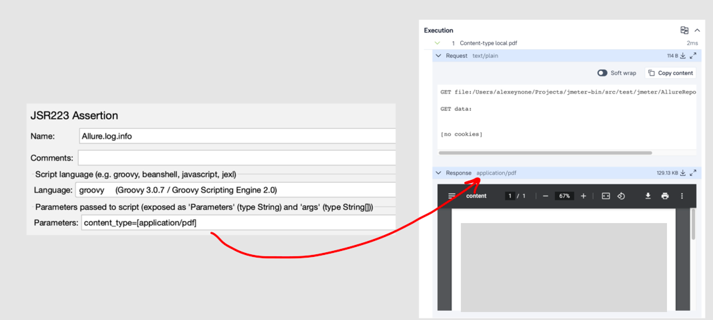
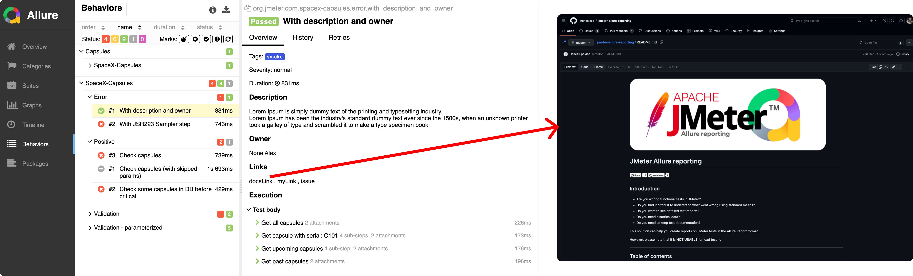
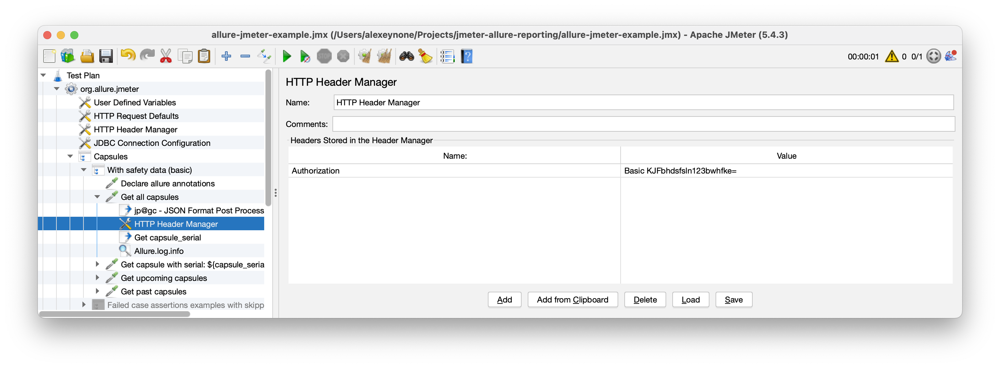
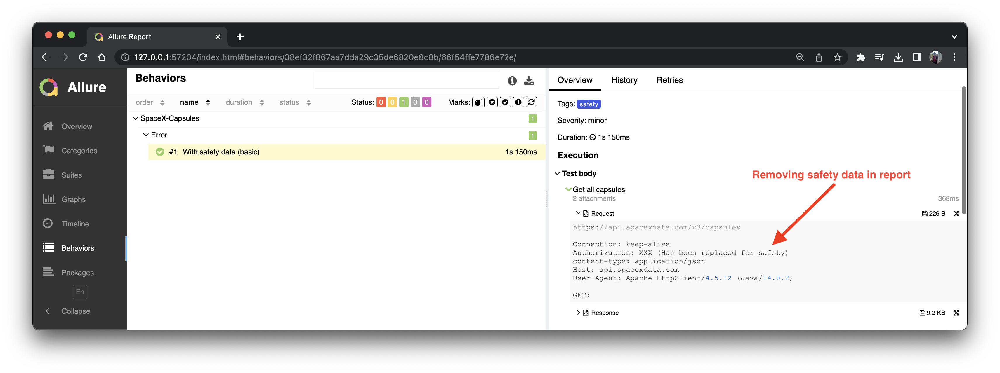

# JMeter Allure reporting

[](https://github.com/nonealexq/jmeter-allure-reporting/stargazers)
[](https://github.com/nonealexq/jmeter-allure-reporting/watchers)
---
## Introduction
- Are you writing functional tests in JMeter?
- Do you find it difficult to understand what went wrong using standard means?
- Do you want to see detailed test reports?
- Do you need historical data?
- Do you need to keep test documentation?

This solution can help you create reports on JMeter tests in the Allure Report format.

However, please note that it is **NOT USABLE** for load testing.

---

## Table of contents
- [Quick start via docker-compose](#quick-start-via-docker-compose)
- [Quick start via GUI-Mode](#quick-start-via-gui-mode)
- [Variables to generate report](#variables-to-generate-report)
- [How it works](#how-it-works)
- [Additional features](#additional-features)
- [Log details to console](#log-details-to-console)
---

##  Quick start via docker-compose
```bash
docker compose up && \
docker cp jmeter:/result/allure-results allure-results-example &&\
docker rm -f jmeter &&\
allure generate allure-results-example --clean -o allure-report
allure open allure-report/
```
---

## Quick start via GUI-Mode
```bash
chmod +x installer.sh
./installer.sh
./apache-jmeter/bin/jmeter -t allure-jmeter-example.jmx
allure generate allure-results/ --clean -o allure-report
allure open allure-report/
```

Then you should change the two variables in User Defined Variables to an absolute path and click RUN.

#### _ALLURE_REPORT_PATH:
- To run it via docker-compose just put `'/result/allure-results'`
- To run locally provide the absolute path to the `allure-results` folder

#### _ALLURE_CONFIG_PATH:
- To run via docker-compose, just put `allure-reporter.groovy` (this file is already located in the root directory).
- To run locally provide the absolute path to the `allure-reporter.groovy`

---

## How it works
First, you need to initialize the parameters that are required to generate test results:


If the case consists of several steps, it should look like this:


Declare annotations before first step:


Declare parameters in JSR223 Assertion:


For example, if the case consists of one step a validation check looks like this:


Do not use parameters if case has one step:


Default report looks like this:

- After running the script, files will be created in the `allure-results` folder for generating the report.
  Next, you can generate the Allure Report by using the following command:
```bash
allure generate allure-results --clean -o allure-report
```

Allure Report would look like this:


## Works with the following Assertions:

| Assertion                         |
|--------------------               |
| Response Assertion                |
| JSON Assertion                    |
| Size Assertion                    |
| jp@gc - JSON/YAML Path Assertion  |

It should also work with the rest of the default assertions.

## Additional features
### Skipped annotations
If you would like to ignore test case, just add 'skipped' to the parameters near 'stop':


### Critical annotations
If you have critical main case to prepares data for next tests, you may use 'critical' parameters.
If this case fails - all next tests (thread group) will be stopped.


### Parameters annotations
The Markdown Table Data-driven Controller plugin allows you to use parameterized tests. We can put our params to the report
1. Add Markdown Controller with params
   
2. Add variables to the main annotations like this:
   ```bash
   vars.put("allure.parameters","capsule_name,second_example_name_variable")
   ```
   
3. Add parameters to the sub annotations like this:
   ```bash
   parameters=[error_message_expected]
   
   // if step parameters more 1 - write with comma like
   // parameters=[variable1,variable2,error_message_expected]
   ```

   
4. Run the tests and then generate the report.
   


---

### Keep in report JSR223 Sampler
1. Just use JSR223 Sampler as simple step
2. Add sub annotation and asserts
3. Generate report
   

---

### Add description
You can add some description to your test using this variable
   ```bash
  vars.put("allure.description","Lorem Ipsum is simply dummy text of the printing and typesetting industry. \\nLorem Ipsum has been the industry's standard dummy text ever since the 1500s, when an unknown printer took a galley of type and scrambled it to make a type specimen book");
   ```
### Change response content-type manually
Content-type is set automatically. If the default content-type of the response is incorrect, you can change it manually:

   ```bash
    content_type=[application/pdf]
   ```


### Add link
You can add any links to your test like this:
   ```bash
  vars.put("allure.links","issue,https://github.com/nonealexq/jmeter-allure-reporting/issues/6");
   ```

Also, you can add multiple links in one string like:
   ```bash
   vars.put("allure.links","issue,https://github.com/nonealexq/jmeter-allure-reporting/issues/8," + "google.com,https://google.com");
   ```


---
### Add issues (Only for AllureTMS)
You can add any issues to your test like this:
```
vars.put("allure.label.issue","JIRA_PROJECT_ID-100");
```
Also, you can add multiple issues in one string like:
```
vars.put("allure.label.issues","JIRA_PROJECT_ID-100,"JIRA_PROJECT_ID-129");
```
---

### Add any custom label
If you want to add some custom label (for example severity/owner/tag) - you can do it!
   ```bash
  vars.put("allure.label.severity","critical");
  vars.put("allure.label.owner","None Alex");
  vars.put("allure.label.tag","smoke");
   ```
Also, you can add multiple tags like this:
   ```bash
   vars.put("allure.label.tags","critical,smoke,api,");
   ```
---

### Ignore links or tags annotations in your solostep tests  

This is often useful if you are create tests in MarkDown Table Data Driven Controller.
When you need to create report one of the test without tags/links from ```Declare allure annotations``` you can use this parameters:
- ```ignore_links``` - will not add any links to your solostep test
- ```ignore_tags``` -  will not add any tags to your solostep test

---
Look and feel with additional features:


---

### Remove safety data in request
We do not recommend storing sensitive information in the reports. By default, all mentions of such information are overwritten



---

## Log details to console
1. The passing time of the test is logged.
2. The number of passed tests is logged.
3. Information about test passing status is logged at the end of the line along with the corresponding status.
4. Critical failed tests are logged at the WARN level.
   
5. An error is logged if the start, continue, or stop annotations are not correct.
   

---

## Troubleshooting:
- In a test case with multiple steps, if you forget to add one of the parameters in one of the steps,
  that step will not make it to the report, and something will definitely go wrong. So, be careful!
